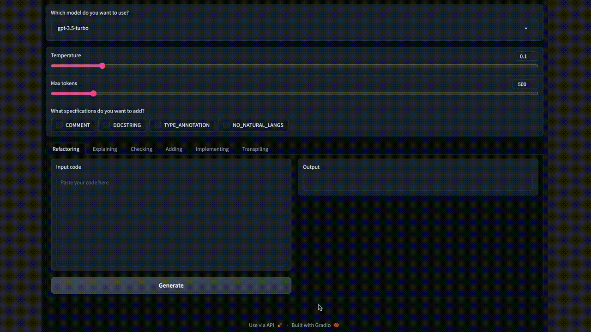

# Coding Assistant

A simple coding assistant app powered by [Microsoft guidance](https://github.com/microsoft/guidance), OpenAI LLMs, and [Gradio](https://github.com/gradio-app/gradio).

<p align="center">
  
</p>

This app slightly ease your coding life by providing some features like refactoring, code explanation, and so on.

What you can do with this tool (for now):

- Refactor a code
- Make LLM explain a code
- Check issues in a code
- Add new feature to a code
- Implement a new feature with a given specification
- Transpile code to desired language

This repo is quite an _oreore_ implementation and full of problems.
Please throw issues and PRs if you have any improvements or new ideas!

## Installation

1. Install rye

```bash
make install-rye-bash
```

2. Install dependencies

```bash
source ~/.bashrc
rye sync
```

3. Allocate `OPENAI_API_KEY` in `./.env`

## Usage

Launch Gradio app.

```bash
make launch
```
